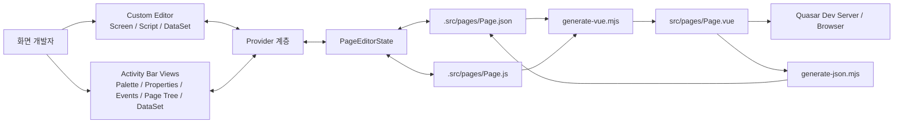
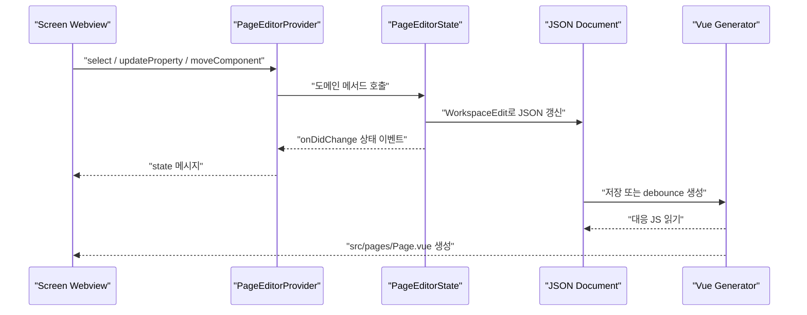
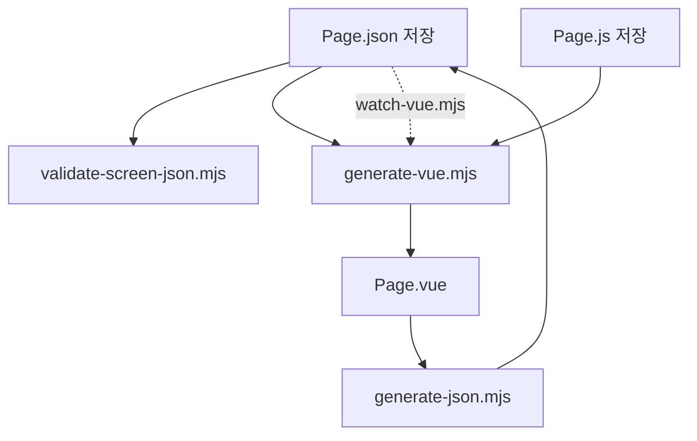

# Quasar Tool 아키텍처 설계서

## 1. 목적

Quasar Tool은 VS Code 안에서 JSON 기반 Quasar/Vue 화면을 시각적으로 설계하고, JavaScript와 DataSet을 함께 편집한 뒤 실행 가능한 Vue SFC를 생성하는 개발 도구다. iframe 미리보기 대신 확장 Webview에서 로컬 Vue 및 Quasar 런타임을 직접 로드해 브라우저 출력과 최대한 동일한 컴포넌트 트리를 렌더링한다.

## 2. 시스템 구성



## 3. 실행 계층

### VS Code Extension Host

`extension.js`가 확장을 활성화하고 Custom Editor와 다섯 개 Webview View를 등록한다. `.src/pages/*.js` 파일 감시기와 JSON 저장 이벤트도 여기서 연결한다.

### Provider 계층

`providers.js`는 Webview에서 수신한 메시지를 상태 메서드로 변환한다. 각 뷰는 동일한 `PageEditorState`를 공유하므로 Screen에서 선택한 컴포넌트가 Page Tree, Properties, Events에도 즉시 반영된다.

### 상태 및 도메인 계층

`state.js`가 현재 문서, 선택 ID, 활성 탭, 외부 스크립트, 클립보드, DataSet과 화면 변경을 소유한다. 모든 모델 수정은 `updateModel()`을 통해 JSON 문서에 반영되고 변경 이벤트를 발생시킨다.

### Webview 표현 계층

- `webviews.js`: Custom Editor 본체, Vue/Quasar 런타임 렌더링, Monaco Script 편집기, DataSet 화면
- `paletteView.js`: 컴포넌트 추가 및 드래그 시작
- `propertiesView.js`: 속성 및 Quasar class 선택
- `eventsView.js`: 이벤트 핸들러 생성 및 Script 이동
- `pageTreeView.js`: 계층 탐색, 펼침/접힘, 이동, 삭제, 클립보드

## 4. 화면 편집 데이터 흐름



## 5. 화면 정의 모델

화면 정의의 핵심 구조는 다음과 같다.

```json
{
  "schemaVersion": "0.1.0",
  "page": { "id": "IndexPage", "component": "QPage" },
  "data": {},
  "components": [
    {
      "id": "QBtn001",
      "type": "QBtn",
      "props": { "label": "검색", "color": "primary" },
      "class": "q-ml-sm",
      "style": "min-width: 80px",
      "events": { "click": "onClick_QBtn001" },
      "children": []
    }
  ],
  "script": { "src": "IndexPage.js" },
  "datasets": [{ "name": "defaultDataset", "fields": [] }]
}
```

### 모델 규칙

- `id`는 화면 안에서 유일해야 한다.
- `type`은 Quasar 컴포넌트 또는 `HtmlElement`다.
- 정적 속성은 `props`, 동적 바인딩은 `dynamicProps`, 양방향 바인딩은 `models`에 둔다.
- CSS class는 `class`, inline style은 최상위 `style`에 둔다.
- 이벤트 키는 Vue 이벤트명, 값은 외부 JS의 함수명이다.
- 계층은 `children`으로 표현한다.
- `designer`는 편집기 전용 메타데이터이며 생성 화면의 사용자 로직과 분리한다.

## 6. Screen 런타임 설계

Screen 탭은 `webviewResources.js`가 확인한 다음 리소스를 Webview URI로 변환해 로드한다.

- `vue.global.prod.js`
- `quasar.umd.prod.js`
- `quasar.prod.css`
- Material Icons CSS
- Monaco loader와 JavaScript worker

JSON 컴포넌트는 런타임 VNode로 변환되며, 선택 테두리, 드래그 대상, 크기 조절 핸들, Grid `col-N` 배지는 편집기 보조 요소로만 겹쳐 표시한다.

## 7. Form Search Grid 설계

- 행/열 추가 및 삭제는 선택 위치를 기준으로 처리한다.
- 행 추가는 선택 행과 동일한 구조를 새 ID로 복제한다.
- 열 추가는 선택 열 오른쪽에 빈 열을 추가한다.
- 칸 나누기는 선택 셀의 `col-N`을 정수 폭으로 나눠 같은 부모 행에 형제 셀을 생성한다.
- 줄 나누기는 선택 셀의 외부 `col-N`과 부모 행을 유지하고 셀 내부에 세로 구획을 만든다.
- 행 높이와 셀 폭은 Screen의 드래그 핸들로 조정한다.
- Grid 배지는 Screen 도구 버튼으로 표시 여부를 저장한다.

## 8. 생성 및 역변환



- 정방향: JSON 구조와 외부 JS를 조합해 `<template>` 및 `<script setup>`을 생성한다.
- 역방향: Vue template과 script setup을 파싱해 JSON 및 JS 쌍으로 복원한다.
- 자동 생성: 확장 저장 이벤트 또는 `watch:vue`가 변경된 파일만 처리한다.

## 9. 확장 방향

1. JSON-Vue 생성 안정화
2. Palette, Properties, Events 고도화
3. 드래그앤드롭 및 레이아웃 편집 강화
4. 공통코드, 팝업, API, Grid 메타모델 추가
5. 설치형 VS Code Extension 패키징과 배포

